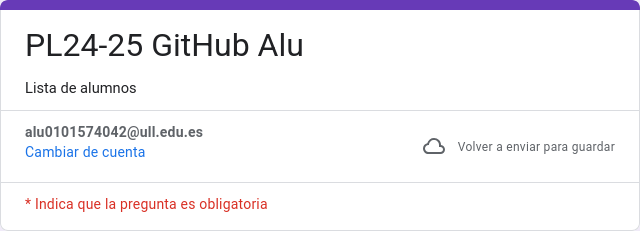
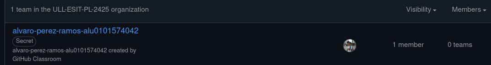
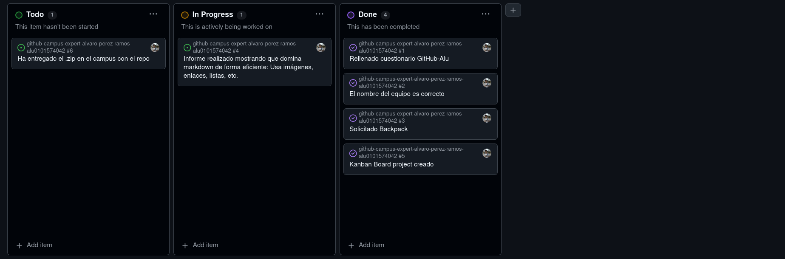
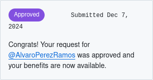

# Github Campus Expert 

- Álvaro 
- Pérez Ramos
- alu0101574042

## Rellenar el cuestionario GitHub-Alu del campus virtual y recibir el correo confirmándolo

## Crear equipo con nombre correcto

## Crear un project board kanban para este repositorio

## Solicitar el GitHub Backpack

## Stast de esta repo

